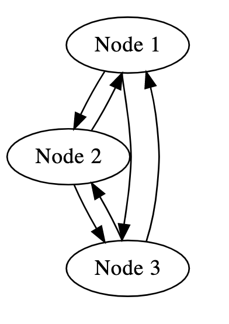
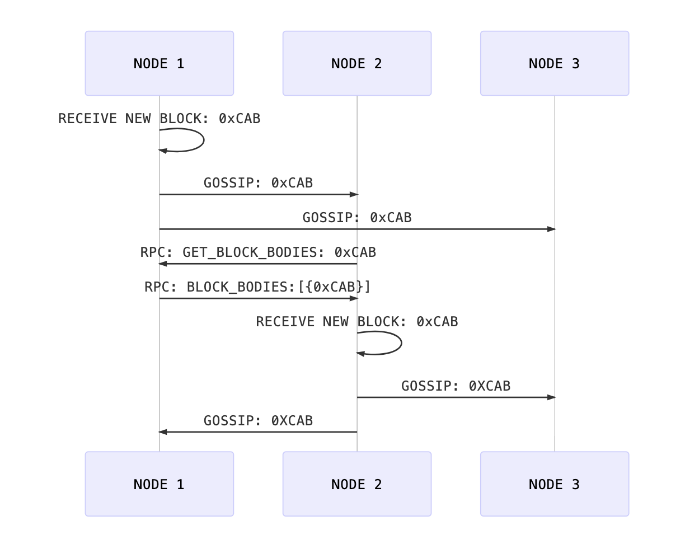

# Hobbits

## Table of Contents

1. [Abstract](#abstract)
2. [Flow](#flow)
3. [Wire Protocol](#wire-protocol)
    1. [Messages](#messages)
4. [Protocols](#protocols)
    1. [RPC](#rpc)
    2. [GOSSIP](#gossip)
    3. [PING](#ping)
5. [Implementations](#implementations)

## Abstract

Hobbits is a modular wire protocol which allows implementers to experiment with various application logic over a practical network in an agnostic and expedient manner.

Hobbits wire protocol was developed so that Eth2.0 clients could begin network-level testing without requiring libp2p.

## Flow

We layout a network where the nodes are peered in the following manner:



The following flow dictates how blocks are shared amongst peers:



1. Node 1 receives a new block `0xCAB` and gossips `hash(0xCAB)` to Node 2 and Node 3
2. Node 2 requests the block bodies for block `0xCAB` from Node 1 in an RPC Command query
3. Node 1 responds to Node 2 with the block bodies for block `0xCAB` in an RPC Command response
4. Node 2 receives a new block `0xCAB` and gossips it to Node 1 and Node 3

## Wire Protocol

### Messages

The `message` format looks as follows:

```
<preamble><version><protocol><header-length><body-length><header><body>
```

| Field | Definition |
| ----- | ---------- |
| preamble | utf-8 encoded `EWP` |
| version | 4-byte encoded `uint32` that represents the hobbits version. (Current Version: 3) |
| protocol | 1-byte encoded `uint8` that represents the protocol (0 - RPC, 1 - GOSSIP, 2 - PING) |
| header-length | 4-byte encoded `uint32` that represents the header length. |
| body-length | 4-byte encoded `uint32` that represents the body length. |
| header | byte encoded header |
| body | byte encoded body |

**NOTE:** 
 - Message `body`s along with `header` fields are BSON encoded.
 - All `int` types are big endian encoded.

#### Fields

Every hobbit message contains the following fields: 

| Field | Definition | Validity |
|:------:|----------|:----:|
| `version` | Defines the EWP version number e.g. `2`. | `uint32` |
| `protocol` | Defines the [protocol](#protocols). | `(RPC\|GOSSIP\|PING)` |
| `header` | Defines the header | payload |
| `body` | Defines the body | payload |

## Protocols

Hobbits defines 3 protocols that dictate how messages are interpreted and responded to.

### RPC

The RPC protocol defines the interaction between two peers exchanging messages to coordinate their actions.

The messages range from communicating status and metadata to exchanging block data to synchronize chains.

#### Envelope

```python
{ 
  'method_id': 'uint16' ## byte representing the method
  'id': 'uint64' ## id of the request
  'body': 'bytes' ## body of the request itself
}
```

The `body` field contains an [SSZ](https://github.com/ethereum/eth2.0-specs/blob/dev/specs/simple-serialize.md) encoded byte array. 

##### Example

Below you will find an example `RPC` message.

```
EWP 3 RPC 65 0
{
  "method_id": 0x01,
  "id": 1,
  "body": {
    "bodies": "0x2a00000000000000"
  }
}
```
#### RPC Methods

There are two types of RPC methods: one that requests data and one that responds with data.

* Peers may request blocks and headers from other peers, possibly in response to a `GOSSIP` message. 
* Peers may request blocks repeatedly from the same peers.
* Other peers may respond on a best effort basis with header and block data.
* There is no SLA for responding. 

##### Handshake

###### `0x00` HELLO

Upon discovering each other, nodes may exchange `HELLO` messages.

Nodes may send `HELLO` to other peers when they exchange messages for the first time or when their state changes to let them know new blocks are available.

Nodes can send `HELLO` messages to each other to exchange information on their status:

```python
{
  'network_id': 'uint8' ## the ID of the network (1 for mainnet, and some predefined number for a testnet)
  'chain_id': 'uint8' ## the ID of the chain (1 for ETH)
  'latest_finalized_root': 'bytes32' ## the hash of the latest finalized root
  'latest_finalized_epoch': 'uint64' ## the number of the latest finalized epoch
  'best_root': 'bytes32' ## the hash of the best root this node can offer
  'best_slot': 'uint64' ## the number of the best slot this node can offer
}
```

Upon receiving a `HELLO` message, the node should reply with a `HELLO` message.

###### `0x01` GOODBYE

Nodes may signal to other nodes that they are going away by sending a `GOODBYE` message:

```python
{
  'reason': 'uint64' ## an optional reason code up to the client
}
```

The reason given is optional. Reason codes are up to each client and should not be trusted.

Upon receiving a `GOODBYE` message, no response is necessary.

##### `0x02` GET_STATUS

Nodes may exchange metadata information using a `GET_STATUS` message.
<!--is this necessary?-->
A `GET_STATUS` request may be sent in response to receiving a `GOSSIP` message:

```python
{
  'user_agent': 'bytes' ## the human readable name of the client, optionally with its version and other metadata
  'timestamp': 'uint64' ## the current time of the node in milliseconds since epoch
}
```

Any peer may provide information about their status and metadata to any other peer. Other peers may respond on a best effort basis, if at all.

##### Block Headers

###### `0x0A` GET_BLOCK_HEADERS

Nodes may request block headers from other nodes using the `GET_BLOCK_HEADERS` message:

<!--is this necessary?-->
```python
{
  'start_root': 'bytes32' ## the root hash to start querying from OR
  'start_slot': 'uint64' ## the slot number to start querying from
  'max': 'uint64' ## the max number of elements to return
  'skip': 'uint64' ## the number of elements apart to pick from
  'direction': 'uint8' ## 0x01 is ascending, 0x00 is descending direction to query elements
}
```

A `GET_BLOCK_HEADERS` request may be sent in response to receiving a `GOSSIP` message.

###### `0x0B` BLOCK_HEADERS

Nodes may provide block roots to other nodes using the `BLOCK_HEADERS` message, usually in response to a `GET_BLOCK_HEADERS` message:

```python
{
  'headers': '[]BeaconBlockHeader'
}
```

##### Block Bodies

###### `0x0C` GET_BLOCK_BODIES

Nodes may request block bodies from other nodes using the `GET_BLOCK_BODIES` message:

```python
{
  'start_root': 'bytes32' ## the root hash to start querying from OR
  'start_slot': 'uint64' ## the slot number to start querying from
  'max': 'uint64' ## the max number of elements to return
  'skip': 'uint64' ## the number of elements apart to pick from
  'direction': 'uint8' ## `0x01` is ascending, `0x00` is descending direction to query elements
}
```

###### `0x0D` BLOCK_BODIES

Nodes may provide block roots to other nodes using the `BLOCK_BODIES` message, usually in response to a `GET_BLOCK_BODIES` message:

```python
{
  'bodies': '[]BeaconBlock'
}
```

##### Attestations

###### GET_ATTESTATION

Nodes may request an attestation from other nodes using the `GET_ATTESTATION` message:

```python
{
    'signature' : 'bytes'
}
```

###### ATTESTATION

```python
{
    'attestation' : 'Attestation'
}
```

### GOSSIP

The gossip protocol allows the propagation of a message to all peers by gossiping the message or its attestation.

For the scope of this specification, only the GOSSIP message is defined, so all peers receive a full copy of the message.

#### Envelope

The message must contain the following header:

```python
{ 
  'method_id': 'uint16' ## the method used in this exchange, as described below
  'topic': 'string' ## the type of message being exchanged
  'timestamp': 'uint32' ## timestamp when the message was sent
  'message_hash': 'bytes32' ## a hash uniquely representing the message contents, with a hash function up to the application
  'hash_signature': 'bytes32' ## a signature of the message hash with a public key identifying the node sending data
}
```

##### Example
```
EWP 3 GOSSIP 222 0
{
  "method_id": 3,
  "topic": "BLOCK",
  "timestamp": 1560471980,
  "message_hash": "0x9D686F6262697473206172652074776F20616E6420666F75722066656574",
  "hash_signature": "0x0000000009A4672656E63682070656F706C6520617265207468652062657374"
}
```

The message may contain additional headers specified by the application layer.

#### GOSSIP Methods

<!--should we include examples of messages?-->
<!--should we include that RPC commands can be a response to IHAVE message?-->

##### `0x00` GOSSIP

Nodes use `GOSSIP` methods to send data to other nodes in the network.

The body of a `GOSSIP` method consists in the data being gossiped.

**@TODO: is the body an ssz encoded byte array?**

The `message_hash` header value must match the hash of the contents of the body according to a predefined hash function defined by the application.

### PING

The ping/pong protocol is used to test connections between two peers and ensure the Hobbits implementation is passing conformance tests.

When a `PING` message is received, the node must respond with the body of the `PING` message as a `PONG` message.

#### PING methods

##### Ping

```
EWP 3 PING 4 32
ping<body bytes>
```

Headers: `ping` as UTF-8 bytes

Body: `random 32 bytes`

##### Pong

```
EWP 3 PING 4 32
pong<body bytes>
```

Headers: `pong` as UTF-8 bytes

Body: `32 bytes sent by the ping packet`

## Implementations

As a reference, the following implementations exist:
 - [go-hobbits](https://github.com/renaynay/go-hobbits)
 - [Apache Tuweni](https://github.com/apache/incubator-tuweni)

## Acknowlegments

This project would not exist without the dedication of the following individuals. 

* Zak Cole
* Dean Eigenmann
* Matt Elder
* Rene Nayman
* Jonny Rhea
* Preston Van Loon

